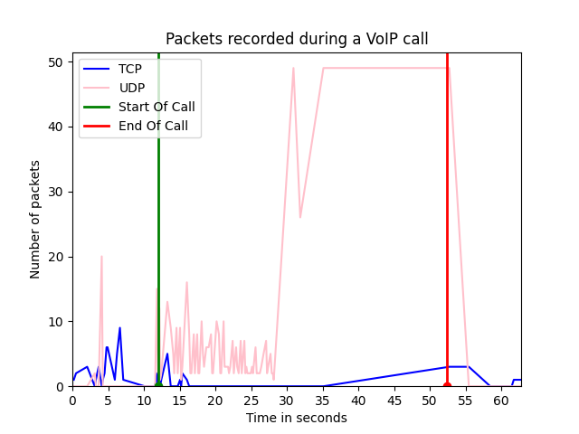
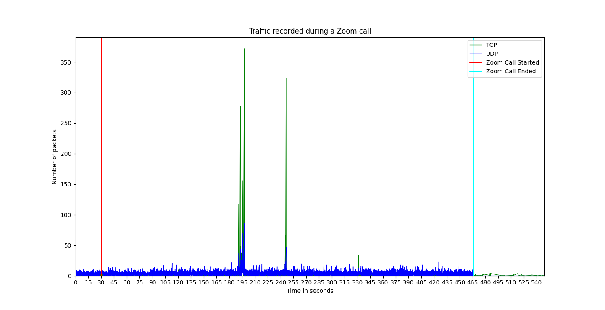

# Network Application Analyzers

## Whatsapp Call Analyzer

This CLI tool can be used to:
- Detect the start and end of a call
- Detect the duration of a call
- Detect which user ended the call

#### Sample generated using the CLI tool

## Zoom Call Analyzer

This CLI tool can be used to:
- Detect the start and end of a zoom meeting
- Detect when the user is in the waiting room or not yet connected to the meeting
- Detect the duration of a zoom meeting

#### Sample generated using the CLI tool

